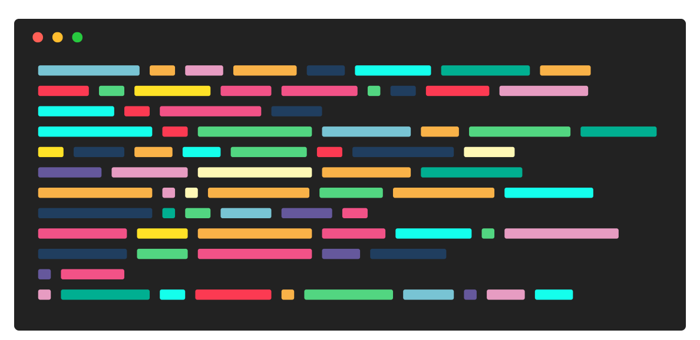
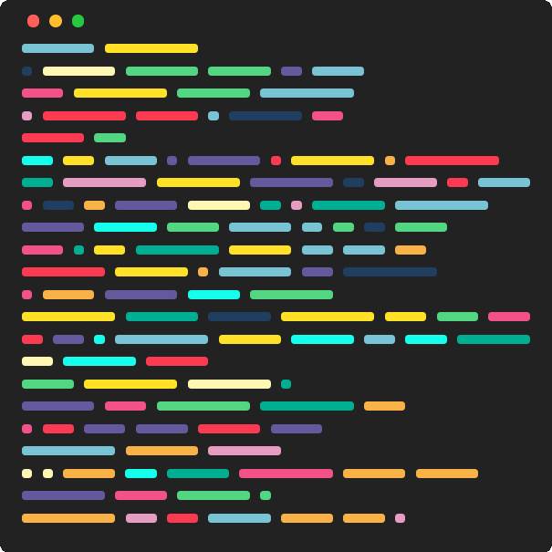

# Random editor preview generator

The result will be like this:

<figure class="post-figure">

</figure>

You can change colors from `app.js` file, just put as much as color you want on `colorsList` and comment the others.

I pre defined some colors too.

You can change number of lines by changing `numberOfLines` variable.

And on mobile devices will be like:

<figure class="post-figure">

</figure>

